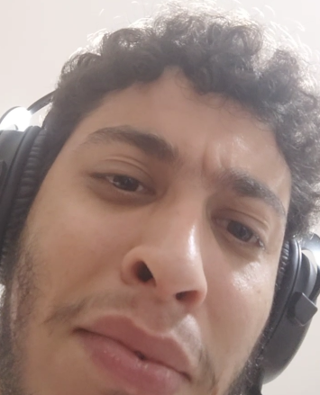

  <picture>
    <source media="(min-width:650px)" srcset=".github/images/image.png" width="150" height="150">
    <source media="(min-width:465px)" srcset=".github/images/image.png" width="150" height="150">
    
  </picture>

 

  <h3 align="center">Bostil Bot</h3>

  

    This is a discord bot for the Bostil server, but it can be used in any server.
     
    <a href="https://github.com/kszinhu/bostil-bot"><strong>Explore the docs »</strong></a>
     
     
    <a href="[bot-invite-url]">Invite Bot</a>
    ·
    <a href="https://github.com/kszinhu/bostil-bot/issues">Report Bug</a>
    ·
    <a href="https://github.com/kszinhu/bostil-bot/issues">Request Feature</a>
  

<!-- TABLE OF CONTENTS -->

  
Table of Contents

  <ol>
    <li>
      <a href="#about-the-project">About The Project</a>
      <ul>
        <li><a href="#todo">Built With</a></li>
      </ul>
    </li>
  </ol>

## TODO

- [ ] Comandos para usar a soundboard do discord (Aguardo suporte do Discord)
- [ ] Bem-vindo ao servidor
- [ ] Comandos de moderação
- [ ] Integração com:
  - Bot [Jukes Box](https://discord.com/api/oauth2/authorize?client_id=716828755003310091&permissions=3271680&scope=applications.commands%20bot) para alterar a atividade do bot

<!-- bot link variable -->

[bot-invite-url]: https://discord.com/api/oauth2/authorize?client_id=1127420791827484752&permissions=8&scope=bot
